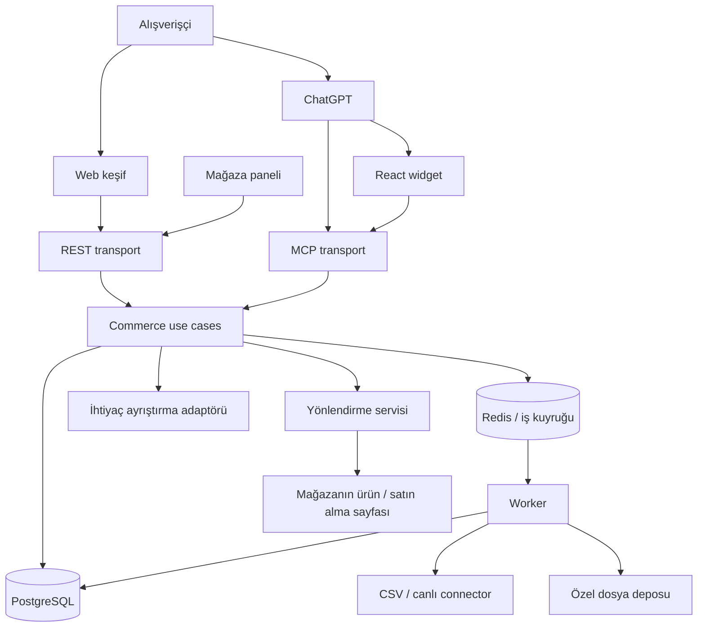

# Sistem ve monorepo

## Sistem sınırı

ShopAI ürün keşfi ve yönlendirme yapar. Kaynak mağaza fiyat, stok ve satın alma işleminin sahibidir. Katalog bağlantısı ürünleri yayımlama izni ve satış raporlama yetkisiyle aynı kabul edilmez; her biri onboarding sırasında doğrulanır.



## Önerilen repo ağacı

Bu ağaç hedef yapıdır; klasörlerin tümünü boş paketler olarak ilk gün açmak gerekmez.

```text
shopai/
├── apps/
│   ├── web/                 # Next.js: /discover, /stores/:slug, /dashboard
│   ├── api/                 # Fastify: /v1, /mcp, /r, health
│   ├── worker/              # BullMQ tüketicileri, scheduler, import/sync
│   └── chatgpt-widget/      # React + Vite; MCP Apps UI build çıktısı
├── packages/
│   ├── contracts/           # Zod DTO'lar, hata kodları, job/event şemaları
│   ├── commerce/            # Catalog, Search, Merchants, Redirects modülleri
│   ├── db/                  # Drizzle şemaları, migration, repository adaptörleri
│   ├── connectors/          # Ortak arayüz, CSV ve sonradan canlı kaynak
│   ├── ai/                  # Query parser port uygulaması, prompt/eval sürümleri
│   ├── ui/                  # Host bağımsız ürün kartları ve filtre bileşenleri
│   └── config/              # Ortak TS/lint ayarları; secret içermez
├── tests/
│   ├── integration/         # DB, tenant, import, webhook
│   ├── e2e/                 # Import → arama → tıklama
│   └── evals/               # Türkçe alışveriş sorguları ve beklenen sonuçlar
├── infra/                   # Yerel compose; dağıtım örnekleri daha sonra
├── docs/                    # Bu mimari dosyaları ve ADR'ler
├── .env.example             # Yalnız değişken isimleri ve güvenli örnekler
├── pnpm-workspace.yaml
├── package.json
├── pnpm-lock.yaml
└── turbo.json               # Orkestrasyon seçilirse
```

## Bağımlılık kuralları

- `contracts` sunucu bağımlılığı taşımaz. Web, widget ve backend aynı giriş/çıkış şemalarını kullanır.
- `commerce` iş kuralları ve portları tanımlar; Fastify, Next.js, MCP, ORM ve sağlayıcı SDK'sı import etmez.
- `db`, `connectors`, `ai` bu portları uygular. `apps/api` ve `apps/worker` bağımlılıkları bir araya getirir.
- `web` ve `chatgpt-widget` yalnız `contracts`, `ui` ve istemciye uygun config kullanır; DB/secret/connector import edemez.
- `ui` ChatGPT veya Next.js API'lerini bilmez; olayları callback ile dışarı verir. Host köprüsü widget uygulamasında kalır.
- `apps/*` birbirini paket olarak import etmez. Ortak mantık `packages/*` içine çıkarılır.
- Workspace paket adları `@shopai/contracts` biçimindedir; iç bağımlılıklar `workspace:*` ile belirtilir.
- Genel bir `utils` paketi açılmaz; yardımcı kod sahibi olduğu modülde tutulur.

## Dağıtım birimleri

| Birim | Görev | Ölçekleme |
|---|---|---|
| Web | Keşif ve panel | Trafiğe göre |
| API | REST + MCP + yönlendirme | İstek yüküne göre |
| Worker | Import, sync, enrichment | Kuyruk gecikmesine göre |
| Widget build | Statik UI resource | API/CDN üzerinden sürümlü asset |
| PostgreSQL | Ana kayıt sistemi | İlk aşamada yönetilen tek DB |
| Redis | Kuyruk ve kısa ömürlü sınırlama | Kalıcı katalog burada tutulmaz |
| Object storage | Özel import dosyaları | Süreli erişim ve silme politikası |

MCP endpoint'i aynı use case'leri doğrudan çağırır; kendi REST API'sine HTTP isteği atmaz. Böylece aynı iş kuralı iki kez yazılmaz.

## Arama seçimi

İlk sürüm: normalize alanlar + SQL filtreleri + PostgreSQL metin arama/trigram. Türkçe karakterler ve kategori eş anlamlıları örnek sorgularla doğrulanır. pgvector, bu temel yaklaşımın kaçırdığı anlam ilişkileri ölçüldüğünde eklenir. Search engine veya mikroservis geçişi ürün sayısından çok ölçülen gecikme, doğruluk ve işletim ihtiyacıyla kararlaştırılır.
